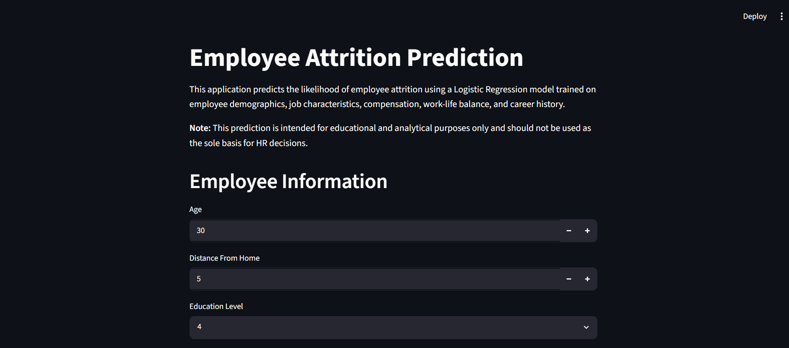
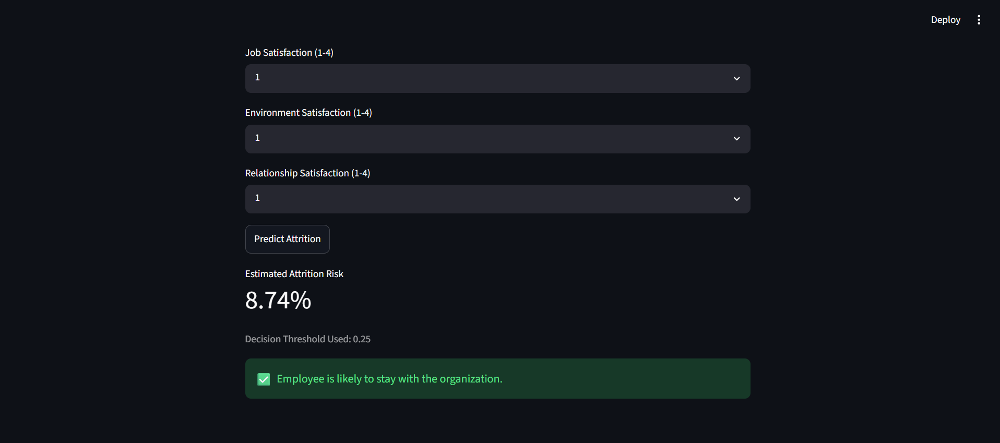

# Employee Attrition Prediction

A machine learning project that predicts employee attrition using HR analytics data from the IBM HR Analytics Employee Attrition & Performance dataset.

The objective is to identify employees who are at risk of leaving the organization by leveraging demographic information, compensation data, job-related attributes, satisfaction metrics, and engineered behavioral features.

---

## Dataset

Dataset: IBM HR Analytics Employee Attrition & Performance

- Rows: 1470
- Original Features: 35
- Target Variable: Attrition

Target Encoding:

| Attrition | Value |
|------------|--------|
| No | 0 |
| Yes | 1 |

The dataset is imbalanced, with only 16.1% attrition cases.

| Class | Count |
|---------|---------|
| Stay | 1233 |
| Leave | 237 |

---

## Application Preview

### Prediction Dashboard



### Example Prediction



---

## Project Workflow

### Data Cleaning

The following columns were removed because they either contained constant values or acted as unique identifiers with no predictive value:

- EmployeeCount
- StandardHours
- Over18
- EmployeeNumber

The target variable was encoded as:

```python
Yes -> 1
No  -> 0
```

---

### Exploratory Data Analysis

Several analyses were performed to understand attrition patterns across both categorical and numerical variables.

Key observations:

- Employees working overtime showed significantly higher attrition rates.
- Single employees had higher attrition than married employees.
- Sales Representatives exhibited the highest attrition among job roles.
- Frequent business travel correlated with increased employee turnover.
- Lower monthly income was associated with higher attrition.
- Employees with shorter tenure were more likely to leave.
- Lower satisfaction metrics corresponded with increased attrition.

EDA included:

- Class imbalance analysis
- Categorical attrition rate analysis
- Numerical feature distribution analysis
- Correlation heatmaps
- Outlier inspection using boxplots
- Job Level vs Department attrition heatmaps

---

### Feature Engineering

To capture employee behavior more effectively, several domain-inspired features were created.

#### TenureRatio

Represents the proportion of an employee's career spent at the current company.

```python
TenureRatio = YearsAtCompany / (TotalWorkingYears + 1)
```

#### IncomePerYearExp

Normalizes monthly income by total work experience.

```python
IncomePerYearExp = MonthlyIncome / (TotalWorkingYears + 1)
```

#### SatisfactionScore

Average of:

- JobSatisfaction
- EnvironmentSatisfaction
- RelationshipSatisfaction

#### PromotionStagnation

Measures promotion frequency relative to company tenure.

```python
PromotionStagnation =
YearsSinceLastPromotion / (YearsAtCompany + 1)
```

#### ManagerStability

Measures consistency of managerial supervision.

```python
ManagerStability =
YearsWithCurrManager / (YearsAtCompany + 1)
```

---

### Feature Reduction

After creating engineered features, the original source variables were removed to reduce redundancy.

Dropped Features:

- YearsAtCompany
- TotalWorkingYears
- YearsWithCurrManager
- YearsSinceLastPromotion
- JobSatisfaction
- EnvironmentSatisfaction
- RelationshipSatisfaction
- MonthlyRate
- DailyRate
- HourlyRate
- JobLevel
- PercentSalaryHike

Final Dataset:

- 23 Features
- 1470 Rows

---

### Skewness Treatment

Feature skewness was analyzed and highly skewed numerical variables were transformed using:

```python
np.log1p()
```

Applied to:

- MonthlyIncome
- IncomePerYearExp
- NumCompaniesWorked
- DistanceFromHome
- YearsInCurrentRole
- PromotionStagnation

This reduced skewness and improved model stability.

---

### Preprocessing Pipeline

A Scikit-Learn ColumnTransformer pipeline was used.

Numerical Features:

- RobustScaler

Categorical Features:

- OneHotEncoder
- drop='first'
- handle_unknown='ignore'

After preprocessing:

- Input Features: 23
- Encoded Features: 37

---

### Train-Test Split

```python
train_test_split(
    test_size=0.20,
    stratify=y,
    random_state=42
)
```

Training Samples: 1176

Testing Samples: 294

---

### Class Imbalance Handling

Because attrition represented only 16.1% of observations, SMOTEENN was evaluated.

SMOTEENN combines:

- SMOTE (Synthetic Minority Oversampling)
- Edited Nearest Neighbours (undersampling)

The technique successfully balanced the training dataset and was included in experimentation.

---

### Model Benchmarking

The following models were evaluated:

- Logistic Regression
- Decision Tree
- Random Forest
- Gradient Boosting
- AdaBoost
- Support Vector Machine
- K-Nearest Neighbours
- Naive Bayes
- XGBoost

Models were compared using:

- Accuracy
- Precision
- Recall
- F1 Score
- ROC-AUC

---

### Hyperparameter Tuning

Hyperparameter optimization was performed using:

```python
GridSearchCV
```

and

```python
RandomizedSearchCV
```

Cross-validation was conducted using Stratified K-Fold splitting.

Optimization metric:

```python
ROC-AUC
```

---

### Final Model Selection

Although multiple ensemble methods and resampling approaches were evaluated, the tuned Logistic Regression model trained on the original dataset provided the best overall balance between:

- Predictive performance
- Generalization
- Interpretability
- Deployment simplicity

---

### Threshold Optimization

Instead of relying on the default classification threshold of 0.50, threshold tuning was performed to maximize F1 Score.

Optimal Threshold:

```python
0.25
```

Using a lower threshold improved the balance between precision and recall for the minority attrition class.

---

## Final Model Performance

| Metric | Score |
|----------|----------|
| Accuracy | 86.05% |
| Precision | 60.00% |
| Recall | 38.30% |
| F1 Score | 46.76% |
| ROC-AUC | 0.801 |

Classification Threshold:

```python
0.25
```

---

## Deployment

The trained artifacts were exported using Joblib:

```text
attrition_model.pkl
preprocessor.pkl
threshold.pkl
```

A Streamlit application was developed to:

- Accept employee information
- Recreate engineered features
- Apply the same preprocessing pipeline used during training
- Generate attrition probabilities
- Classify employees using the optimized threshold

During deployment, an inference mismatch caused incorrect predictions. The issue was traced to missing log transformations in the Streamlit pipeline and was resolved by applying the same feature transformations used during model training.

---

## Repository Structure

```
employee_attrition_prediction/
│
├── EmployeeAttritionPredictionModel.ipynb
├── app.py
├── attrition_model.pkl
├── preprocessor.pkl
├── threshold.pkl
├── requirements.txt
├── README.md
└── screenshots/
```

---

## Technologies Used

- Python
- Pandas
- NumPy
- Matplotlib
- Seaborn
- Scikit-Learn
- Imbalanced-Learn
- XGBoost
- Joblib
- Streamlit

---

## Running Locally

Clone the repository:

```bash
git clone <repository-url>
```

Install dependencies:

```bash
pip install -r requirements.txt
```

Launch the application:

```bash
streamlit run app.py
```